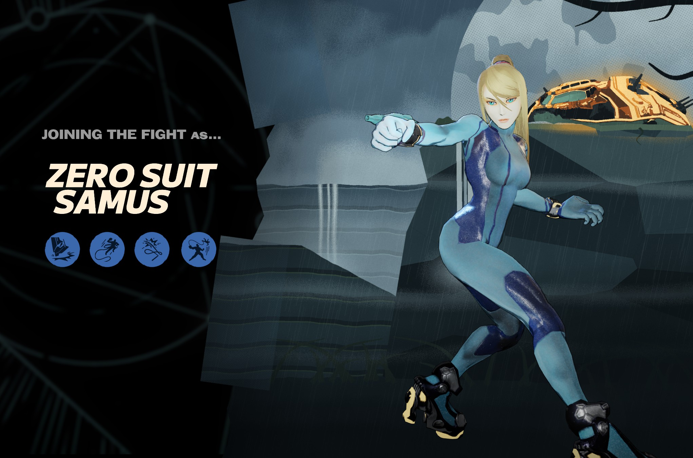
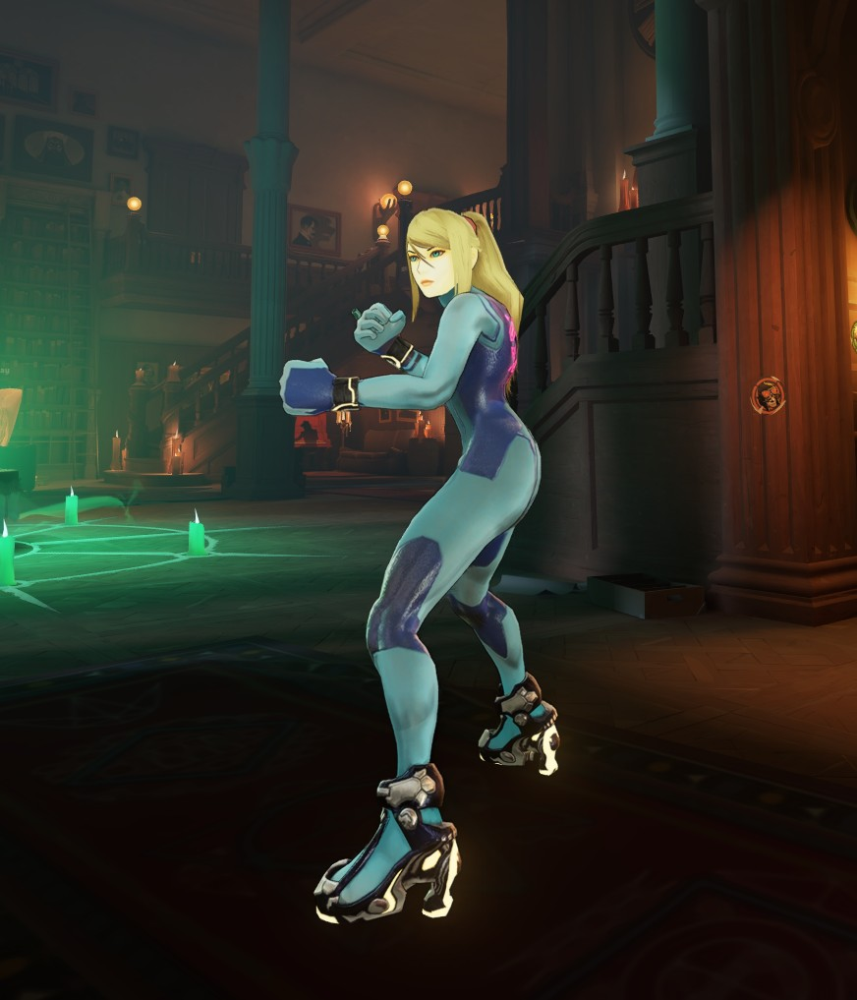
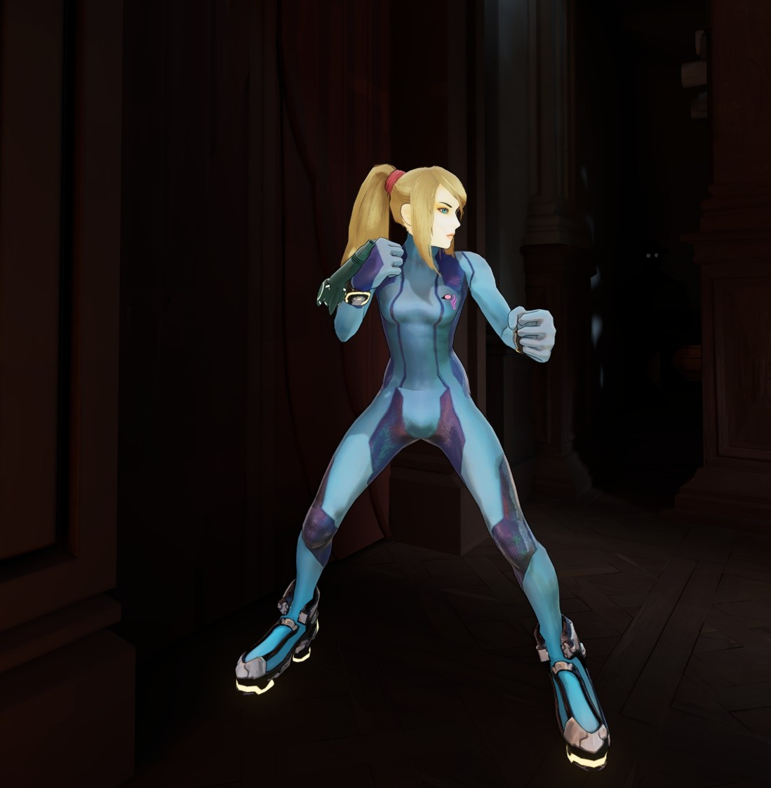

# Zero-Suit-Samus-Lash

Zero Suit Samus from *Super Smash Bros. Ultimate*, replacing Lash in [Deadlock](https://store.steampowered.com/app/1422450/Deadlock/).



## Features

- Zero Suit Samus's model from Smash Ultimate, rigged to Lash, with a more feminine idle and run
- Her ponytail has real hair physics: it swings as she runs and jumps, and settles when she stops
- A wrist cannon designed for her replaces Lash's gauntlet, and it fires with her Paralyzer sound from Smash
- Plasma-whip abilities: the Grapple and Death Slam cables and the Flog whip glow yellow-orange like her Smash plasma whip
- Ground Strike reworked so her hands hit the ground on landing
- Death Slam sounds from Smash Ultimate (the lock-on keeps Lash's sound)
- The Smash announcer calls "Zero Suit Samus!" when you pick her
- Her Smash grunts and efforts, plus her four quips
- Custom hero-select scene: a painted landing site on Tallon IV with her gunship, and a new pose matching her Smash render
- Hero cards, portraits, icons and a ZERO SUIT SAMUS name title

Lash's abilities work exactly as normal. Only their look and sound change.





## Install

1. Download `Zero-Suit-Samus-Lash.zip` from the [latest release](../../releases/latest) and extract `pak03_dir.vpk`.
2. Open `Deadlock\game\citadel\gameinfo.gi` and add this line inside `SearchPaths`, above `Game citadel`:
   ```
   Game                citadel/addons
   ```
3. Put the VPK in `Deadlock\game\citadel\addons\`. Create the folder if it doesn't exist.
4. Launch the game and pick Lash.

Game updates can reset `gameinfo.gi`. If the mod stops loading, add the line again. Deadlock Mod Manager users can install it from GameBanana with one click.

## Known issues

- Samus barely speaks in her games, so most of Lash's voice lines are silent, including pings. Their captions still show.
- She holds the cannon at a slight tilt in some poses (it follows Lash's gauntlet animations).

## Credits

Zero Suit Samus, *Super Smash Bros. Ultimate* and *Metroid Prime* belong to Nintendo. The model, sounds, renders, gunship and voice (Alésia Glidewell; announcer Xander Mobus) come from those games. Deadlock belongs to Valve. This is a free fan mod and isn't affiliated with either.
